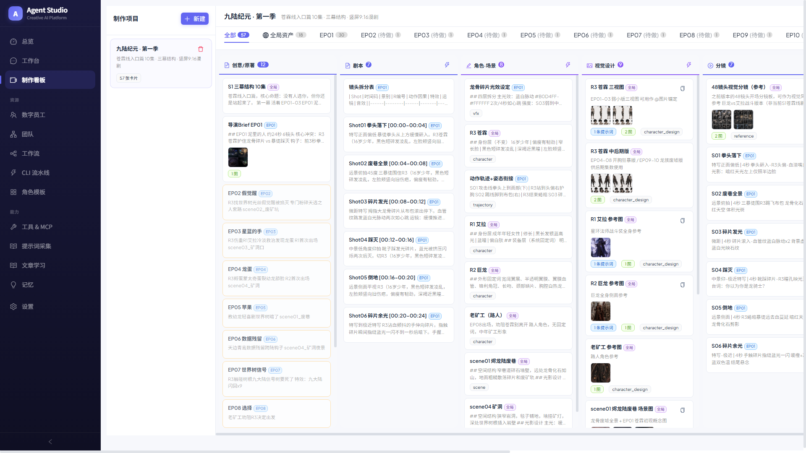
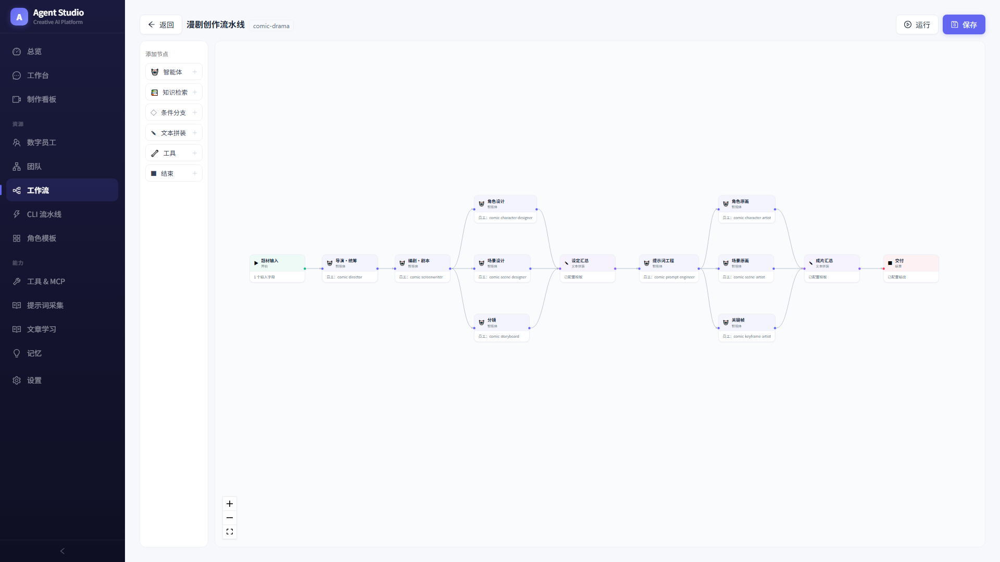
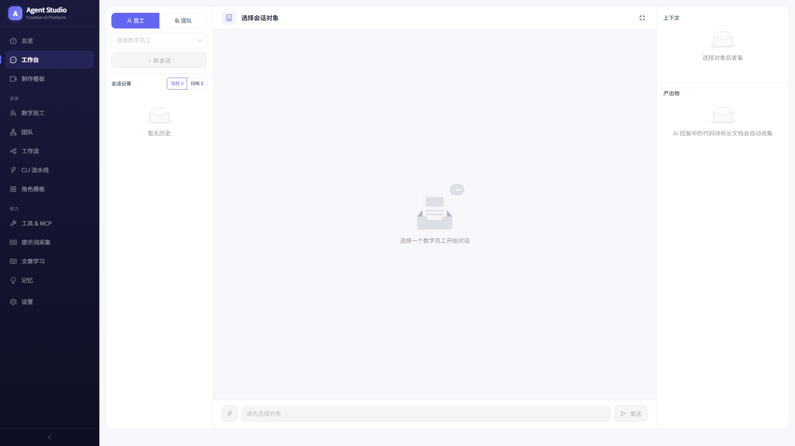

# 🎬 Agent Platform

**AI-powered anime/manga production pipeline — from script to final cut.**

An open-source multi-agent platform for AI-driven short-form anime (漫剧) production. Features a 10-stage production kanban (script → character/scene design → storyboard → image prompts → video prompts → generation → final cut), DIFY-style visual workflow engine, and multi-agent collaboration with delegated task execution.

**AI 驱动的漫剧全流程制作平台，从剧本到成片。**

开源多智能体协作平台，专为 AI 竖屏漫剧制作设计。内置 10 阶段制作看板（剧本 → 角色·场景设定 → 视觉设计 → 分镜 → 图片提示词 → 视频提示词 → 生图 → 生视频 → 成片），类 DIFY 可视化工作流引擎，多个 AI 数字员工按 DAG 流程图自动接力完成复杂任务。

---

## Screenshots / 截图

### Production Kanban / 制作看板


### Workflow Canvas / 工作流画布编辑器


### AI Workbench / AI 对话工作台


---

## 核心功能

### 数字员工管理
- **员工注册表** — 每个员工有独立身份（`employeeKey`）、角色提示词（`roleProfile`）、绑定的工具和技能
- **角色模板库** — 内置 12 种预设角色（数据分析师、文案写手、代码审查员、SEO 分析师等），一键创建员工
- **独立知识库** — 每个员工可上传专属文档（`.txt` / `.md`），对话时自动检索相关片段注入上下文
- **长期记忆** — 对话结束后自动提取关键信息存入员工长期记忆，下次对话可回忆历史

### 团队协作
- **团队结构** — 团队有队长（`leaderEmployeeKey`）、成员角色分阶段排列（统筹 → 创作 → 设计 → 生成）
- **智能委派** — 团队内员工可通过 `delegate_to_employee` 工具将子任务委派给队友，支持深度限制和环路检测
- **审批闸门** — 高风险操作需人工审批（`##PENDING_APPROVAL##`），审批通过后才继续执行

### 可视化工作流引擎（类 DIFY）
- **DAG 画布编辑器** — 基于 ReactFlow 的拖拽式流程图编辑，连线即定义执行顺序
- **7 种节点类型**：

  | 节点 | 作用 |
  |------|------|
  | **开始** | 工作流入口，声明输入字段 |
  | **智能体** | 调用一个数字员工执行任务（多 SubAgent 的核心） |
  | **知识检索** | 检索指定员工知识库片段，注入下游节点 |
  | **条件分支** | if/else 规则路由（支持 12 种比较运算符） |
  | **文本拼装** | 用 `{{node.field}}` 变量模板组合文本，零 token 消耗 |
  | **工具调用** | 调用已注册的工具 / MCP 服务 |
  | **结束** | 汇总输出并返回最终结果 |

- **变量系统** — `{{start.topic}}`、`{{writer.output}}` 等变量在节点间传递数据
- **分支剪枝** — 条件节点只激活命中的出边，死分支整支跳过
- **并行执行** — 无依赖的节点自动并行（`asyncio.gather`）
- **运行面板** — 逐节点查看执行状态、耗时、Token 用量、工具调用轨迹
- **运行历史** — 每次运行自动持久化，支持回溯查看

### 自动化学习
- **提示词采集** — 配置目标网站，定时抓取高质量提示词存入指定员工的知识库
- **文章学习** — 给定文章 URL 列表，LLM 自动总结要点并写入员工知识库 + 长期记忆
- **定时调度** — 内置 DailyScheduler，默认每天凌晨 2:00 自动执行采集和学习任务

### 制作看板（Production Pipeline）
- **10 阶段流水线** — 创意/原著 → 剧本 → 角色·场景 → 视觉设计 → 分镜 → 图片提示词 → 视频提示词 → 生图 → 生视频 → 成片
- **按集组织** — Episode Tab 切换（全局资产 / EP01 / EP02...），全局角色场景跨集共享
- **文字设定与视觉设计分离** — 先定义角色场景的文字设定（身份层/装备层/可变层），再做视觉三视图和概念图
- **AI 逐阶段生成** — 每个阶段可一键 AI 生成，自动基于前置阶段内容
- **素材图片服务** — 内置资源文件 API，直接在卡片中预览已有的角色三视图、场景图、道具图
- **卡片系统** — 每张卡片支持内容、提示词、图片、视频、元数据，支持 Markdown 渲染

### 对话工作台
- **实时对话** — 选择员工直接开始 AI 对话
- **会话管理** — 自动保存会话历史，支持加载历史会话
- **工具轨迹** — 实时展示 AI 调用了哪些工具、传了什么参数、返回了什么结果

## 技术架构

```
┌───────────────────────────────────────────────┐
│                 React 前端                      │
│  React 18 + Ant Design 5 + ReactFlow + Vite   │
│  端口: 5173 (开发) / 静态部署 (生产)            │
└───────────────┬───────────────────────────────┘
                │ /api 代理
┌───────────────▼───────────────────────────────┐
│              FastAPI 后端                       │
│  Python 3.12 + Pydantic v2 + OpenAI SDK       │
│  端口: 8000 (开发) / 5311 (默认)               │
├───────────────────────────────────────────────┤
│  app/api/         REST API 路由层              │
│  app/runtime/     Agent 循环 + 提示词编译       │
│  app/services/    工作流引擎 + 知识库 + 调度器   │
│  app/tools/       工具注册表 + 内置工具          │
│  app/models/      Pydantic 数据模型             │
│  data/            JSON 文件存储（运行时生成）     │
└───────────────────────────────────────────────┘
```

### 后端技术栈
- **Python 3.12** + **FastAPI** — 异步 Web 框架
- **Pydantic v2** — 数据校验与序列化（camelCase 别名兼容前端）
- **OpenAI SDK** — LLM 调用（兼容 OpenAI 格式的任意网关）
- **httpx** — 异步 HTTP 客户端
- **JSON 文件存储** — 零依赖，原子写入（`tmp` + `os.replace`），单用户场景足够
- **asyncio** — 工作流并行执行 + 定时调度

### 前端技术栈
- **React 18** + **TypeScript**
- **Ant Design 5** — UI 组件库
- **ReactFlow 11** — 工作流画布
- **React Router 6** — SPA 路由
- **Vite 6** — 构建工具 + 开发服务器 + HMR

## 快速开始

### 环境要求
- Python 3.12+
- Node.js 18+
- 一个兼容 OpenAI API 格式的 LLM 服务（需要配 endpoint 和 API Key）

### 1. 克隆仓库

```bash
git clone https://github.com/tongren025/agent-platform.git
cd agent-platform
```

### 2. 后端配置

创建 `appsettings.Development.json`（此文件已被 `.gitignore` 排除，不会泄露密钥）：

```json
{
  "aiModels": [
    {
      "name": "default",
      "endpoint": "https://your-openai-compatible-endpoint/",
      "apiKey": "sk-your-api-key-here",
      "enabled": "true",
      "models": [
        {
          "modelName": "gpt-4o",
          "modelId": "gpt-4o",
          "timeoutMinutes": 20
        }
      ]
    }
  ]
}
```

> 支持任何兼容 OpenAI Chat Completions API 的服务（OpenAI、Azure OpenAI、各类国产大模型网关等）。

### 3. 启动后端

```bash
# 创建虚拟环境
python -m venv .venv

# 激活（Windows）
.venv\Scripts\activate
# 激活（Linux/Mac）
source .venv/bin/activate

# 安装依赖
pip install -r requirements.txt

# 启动（开发环境用 8000 端口，与前端代理一致）
uvicorn app.main:app --host 127.0.0.1 --port 8000 --reload
```

### 4. 启动前端

```bash
cd web
npm install
npm run dev
```

### 5. 打开浏览器

访问 http://localhost:5173 即可使用。

## 项目结构

```
agent-platform/
├── app/                          # Python 后端
│   ├── api/                      # REST API 路由
│   │   ├── agent.py              #   智能体对话 API
│   │   ├── registry.py           #   员工/团队/工具/技能 CRUD
│   │   ├── workflow.py           #   工作流 CRUD + 运行
│   │   ├── production.py         #   制作看板 API（项目/卡片 CRUD + AI 生成 + 资源服务）
│   │   ├── scrape.py             #   提示词采集 + 文章学习 API
│   │   ├── memory_api.py         #   记忆管理 API
│   │   └── strategy_proxy.py     #   策略代理 API
│   ├── models/                   # Pydantic 数据模型
│   │   ├── registry.py           #   员工/团队/工具/技能/模板定义
│   │   ├── workflow.py           #   工作流/节点/边/运行记录
│   │   ├── production.py         #   制作看板模型（10阶段流水线/卡片/项目）
│   │   ├── conversation.py       #   对话请求/响应
│   │   ├── knowledge.py          #   知识库文档
│   │   ├── learn.py              #   文章学习源
│   │   ├── scrape.py             #   提示词采集源
│   │   └── memory_types.py       #   长期记忆类型
│   ├── runtime/                  # Agent 运行时
│   │   ├── loop.py               #   Agent 主循环（LLM 调用 + 工具分派）
│   │   ├── runner.py             #   运行编排（快照加载 → 循环 → 结果）
│   │   ├── prompt.py             #   系统提示词编译
│   │   ├── snapshot.py           #   员工运行时快照加载
│   │   ├── scope.py              #   作用域构建（工具/技能/MCP 绑定）
│   │   ├── template.py           #   {{变量}} 模板解析引擎
│   │   └── infra_tools.py        #   平台基础设施工具注册
│   ├── services/                 # 业务服务
│   │   ├── workflow_executor.py  #   工作流 DAG 执行引擎（Kahn 遍历）
│   │   ├── workflow_nodes.py     #   7 种节点执行器（插件注册表）
│   │   ├── workflow_store.py     #   工作流运行记录存储
│   │   ├── seed_workflows.py     #   种子工作流（漫剧创作流水线）
│   │   ├── invocation.py         #   员工调用（审批、委派、循环）
│   │   ├── registry.py           #   JSON 文件注册表（通用 CRUD）
│   │   ├── knowledge.py          #   知识库管理
│   │   ├── memory.py             #   会话记忆管理
│   │   ├── memory_extractor.py   #   长期记忆自动提取
│   │   ├── long_term_memory.py   #   长期记忆存储
│   │   ├── ai.py                 #   AI 模型服务（轮询可用模型）
│   │   ├── scheduler.py          #   DailyScheduler 定时调度器
│   │   ├── scraper.py            #   网页抓取 + LLM 总结
│   │   ├── scrape_runner.py      #   提示词采集执行
│   │   ├── scrape_store.py       #   采集源存储
│   │   ├── learn_runner.py       #   文章学习执行
│   │   └── learn_store.py        #   学习源存储
│   ├── tools/                    # 工具系统
│   │   ├── base.py               #   工具注册表 + ToolContext
│   │   ├── builtin.py            #   内置工具（Shell、知识库查询）
│   │   ├── delegate.py           #   委派工具（跨员工任务分发）
│   │   ├── deep.py               #   深度 Agent（子代理模式）
│   │   └── strategy/             #   策略工具（业务定制）
│   ├── config.py                 # 配置加载（appsettings 合并）
│   ├── dependencies.py           # 单例依赖注入
│   └── main.py                   # FastAPI 入口 + 启动迁移
├── web/                          # React 前端
│   ├── src/
│   │   ├── pages/                # 页面
│   │   │   ├── Dashboard.tsx     #   仪表盘
│   │   │   ├── Employees.tsx     #   员工管理
│   │   │   ├── Teams.tsx         #   团队管理
│   │   │   ├── Workflows.tsx     #   工作流列表
│   │   │   ├── WorkflowEditor.tsx#   工作流画布编辑器
│   │   │   ├── Workbench.tsx     #   对话工作台
│   │   │   ├── Production.tsx    #   制作看板（按集看板 + 卡片详情）
│   │   │   ├── Tools.tsx         #   工具管理
│   │   │   ├── Templates.tsx     #   角色模板库
│   │   │   ├── Memory.tsx        #   记忆管理
│   │   │   ├── Settings.tsx      #   系统设置
│   │   │   ├── AutoLearn.tsx     #   提示词采集
│   │   │   └── ArticleLearn.tsx  #   文章学习
│   │   ├── components/
│   │   │   ├── Layout.tsx        #   全局布局（自绘侧边栏）
│   │   │   ├── TraceList.tsx     #   工具调用轨迹组件
│   │   │   └── workflow/         #   工作流专用组件
│   │   │       ├── WorkflowNodeCard.tsx  # 画布节点卡片
│   │   │       ├── NodeConfigDrawer.tsx  # 节点配置抽屉
│   │   │       ├── RunPanel.tsx          # 运行面板
│   │   │       └── nodeMeta.ts           # 节点类型元数据
│   │   ├── api.ts                # API 调用封装
│   │   ├── types.ts              # TypeScript 类型定义
│   │   ├── theme.ts              # 主题色彩常量
│   │   ├── App.tsx               # 路由配置
│   │   └── main.tsx              # 入口
│   ├── package.json
│   ├── vite.config.ts            # Vite 配置（/api 代理到 8000）
│   └── tsconfig.json
├── appsettings.json              # 基础配置
├── appsettings.Production.json   # 生产环境配置
├── requirements.txt              # Python 依赖
├── pyproject.toml                # Python 项目元数据
└── WORKFLOW_ENGINE.md            # 工作流引擎技术文档
```

## API 概览

所有 API 前缀：`/api/v1/agentapp`

### 注册表（`/registry`）
| 方法 | 路径 | 说明 |
|------|------|------|
| GET | `/employees` | 列出所有员工 |
| POST | `/employees` | 创建员工 |
| PUT | `/employees/{key}` | 更新员工 |
| DELETE | `/employees/{key}` | 删除员工 |
| GET | `/teams` | 列出所有团队 |
| POST | `/teams` | 创建团队 |
| GET | `/tools` | 列出所有工具 |
| GET | `/role-templates` | 列出所有角色模板 |
| POST | `/employees/{key}/knowledge` | 上传知识库文档 |
| GET | `/employees/{key}/knowledge` | 列出知识库文档 |

### 智能体（`/agent`）
| 方法 | 路径 | 说明 |
|------|------|------|
| POST | `/run` | 运行智能体对话 |
| POST | `/run/approve` | 审批通过后继续执行 |
| GET | `/sessions` | 列出会话 |
| GET | `/sessions/{id}` | 获取会话详情 |
| GET | `/ai-models` | 列出可用 AI 模型 |

### 工作流（`/workflow`）
| 方法 | 路径 | 说明 |
|------|------|------|
| GET | `/` | 列出所有工作流 |
| POST | `/` | 创建工作流 |
| GET | `/{key}` | 获取工作流详情 |
| PUT | `/{key}` | 更新工作流 |
| DELETE | `/{key}` | 删除工作流 |
| POST | `/{key}/run` | 运行工作流 |
| GET | `/{key}/runs` | 运行历史 |
| GET | `/node-types` | 可用节点类型列表 |

### 制作看板（`/production`）
| 方法 | 路径 | 说明 |
|------|------|------|
| GET | `/projects` | 列出所有制作项目 |
| POST | `/projects` | 创建制作项目 |
| GET | `/projects/{pid}` | 获取项目详情（含所有卡片） |
| POST | `/projects/{pid}/cards` | 添加卡片 |
| PUT | `/cards/{id}` | 更新卡片 |
| DELETE | `/cards/{id}` | 删除卡片 |
| POST | `/projects/{pid}/generate` | AI 生成指定阶段卡片 |
| GET | `/stages` | 获取 10 阶段定义 |
| GET | `/resource/{path}` | 静态资源文件服务（图片/视频） |

### 自动学习（`/scrape`）
| 方法 | 路径 | 说明 |
|------|------|------|
| GET | `/sources` | 采集源列表 |
| POST | `/sources` | 创建采集源 |
| POST | `/sources/{key}/run` | 立即执行采集 |
| GET | `/learn-sources` | 学习源列表 |
| POST | `/learn-sources` | 创建学习源 |
| POST | `/learn-sources/{key}/run` | 立即执行学习 |

## 安全设计

- **工具节点授权** — 工作流中的工具节点必须指定授权员工（`employeeKey`），且工具必须在该员工的 `toolRefs` 绑定列表内才能执行
- **黑名单机制** — Shell 执行（`execute`）和跨员工委派（`delegate_to_employee`）在工作流节点中硬禁止
- **审批闸门** — 工具返回 `##PENDING_APPROVAL##` 时，工作流节点按失败处理，不会静默跳过人工审批
- **参数注入防护** — 工具参数模板先解析为结构化 JSON 再序列化，插入值被 JSON 转义，无法篡改工具参数
- **委派安全** — 深度限制（默认 3 层）+ 环路检测（`__delegation_stack`）+ 可全局关闭
- **Shell 白名单** — Shell 执行默认关闭，开启后仅允许白名单内的命令
- **条件节点** — 使用安全枚举比较器，绝不使用 `eval`
- **变量解析** — 正则匹配 `{{node.field}}`，缺失变量返回空串（fail-soft），绝不执行动态代码

## 内置示例

### 漫剧创作工作流

系统启动时自动种入一条 13 节点、16 条边的**漫剧创作工作流**，包含 9 个数字员工：

```
导演（统筹）
  → 编剧（创作）
    → 角色设计师 ┐
    → 场景设计师 ├ 并行（设计）
    → 分镜设计师 ┘
      → 提示词工程师（设计）
        → 角色生成师 ┐
        → 场景生成师 ├ 并行（生成）
        → 关键帧生成师┘
          → 成片合成
```

在「工作流」页面可以看到并直接运行这条流水线。

### 制作看板 — 九陆纪元 S1 制作包

附带一套完整的竖屏漫剧制作数据（`_gen_cards_v4.py` 生成），演示 10 阶段流水线：

```
创意/原著 → 剧本 → 角色·场景 → 视觉设计 → 分镜 → 图片提示词 → 视频提示词 → 生图 → 生视频 → 成片
```

- 全局资产 18 张卡片（3 个角色设定 + 三视图、2 个场景设定 + 概念图、道具图集、九大陆场景）
- EP01 完整制作包 30 张卡片（导演 Brief → 镜头拆分表 → 6 镜逐镜头脚本 → 光效/动作设定 → 6 镜分镜板 → 6 条图片提示词 → 6 条视频提示词 + 质检报告）
- EP02-10 待做概要各 1 张

## 已知限制（v1）

- **LLM 调用同步** — 底层 OpenAI SDK 调用为同步模式，并行节点实际串行执行（引擎已支持并行，待迁移 AsyncOpenAI 即可自动并发）
- **无 SSE 实时推送** — 运行状态通过轮询获取，暂无 Server-Sent Events 实时更新
- **文件存储无锁** — 适合单用户 / 开发环境；多用户并发需加锁或换数据库
- **节点类型待扩展** — 迭代（循环）、变量聚合、代码执行、HTTP 请求、子工作流等节点类型规划中

## 许可证

私有项目，仅供内部使用。
